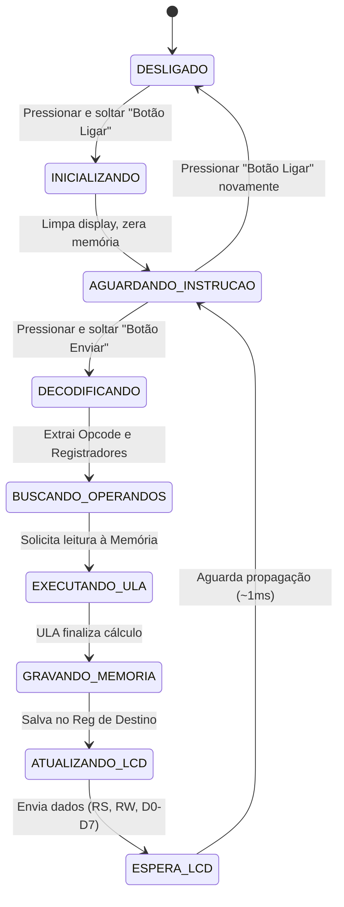
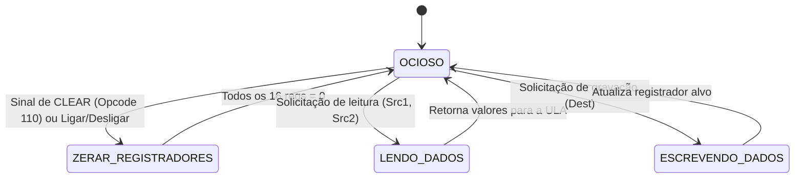
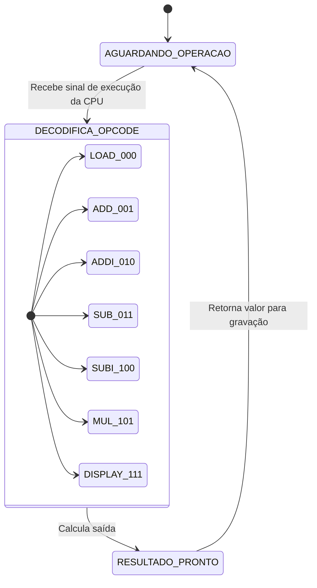

## ULA

```mermaid
stateDiagram-v2
    [*] --> DESLIGADO
    
    DESLIGADO --> INICIALIZANDO : Pressionar e soltar "Botão Ligar"
    
    INICIALIZANDO --> AGUARDANDO_INSTRUCAO : Limpa display, zera memória
    
    AGUARDANDO_INSTRUCAO --> DESLIGADO : Pressionar "Botão Ligar" novamente
    AGUARDANDO_INSTRUCAO --> DECODIFICANDO : Pressionar e soltar "Botão Enviar"
    
    DECODIFICANDO --> BUSCANDO_OPERANDOS : Extrai Opcode e Registradores
    BUSCANDO_OPERANDOS --> EXECUTANDO_ULA : Solicita leitura à Memória
    
    EXECUTANDO_ULA --> GRAVANDO_MEMORIA : ULA finaliza cálculo
    GRAVANDO_MEMORIA --> ATUALIZANDO_LCD : Salva no Reg de Destino
    
    ATUALIZANDO_LCD --> ESPERA_LCD : Envia dados (RS, RW, D0-D7)
    ESPERA_LCD --> AGUARDANDO_INSTRUCAO : Aguarda propagação (~1ms)
```
## MEMORIA

```mermaid

stateDiagram-v2
    [*] --> OCIOSO
    
    OCIOSO --> ZERAR_REGISTRADORES : Sinal de CLEAR (Opcode 110) ou Ligar/Desligar
    ZERAR_REGISTRADORES --> OCIOSO : Todos os 16 regs = 0
    
    OCIOSO --> LENDO_DADOS : Solicitação de leitura (Src1, Src2)
    LENDO_DADOS --> OCIOSO : Retorna valores para a ULA
    
    OCIOSO --> ESCREVENDO_DADOS : Solicitação de gravação (Dest)
    ESCREVENDO_DADOS --> OCIOSO : Atualiza registrador alvo
```
## ULA

```mermaid
stateDiagram-v2
    [*] --> AGUARDANDO_OPERACAO
    
    AGUARDANDO_OPERACAO --> DECODIFICA_OPCODE : Recebe sinal de execução da CPU
    
    state DECODIFICA_OPCODE {
        direction LR
        [*] --> LOAD_000
        [*] --> ADD_001
        [*] --> ADDI_010
        [*] --> SUB_011
        [*] --> SUBI_100
        [*] --> MUL_101
        [*] --> DISPLAY_111
    }
    
    DECODIFICA_OPCODE --> RESULTADO_PRONTO : Calcula saída
    RESULTADO_PRONTO --> AGUARDANDO_OPERACAO : Retorna valor para gravação
```