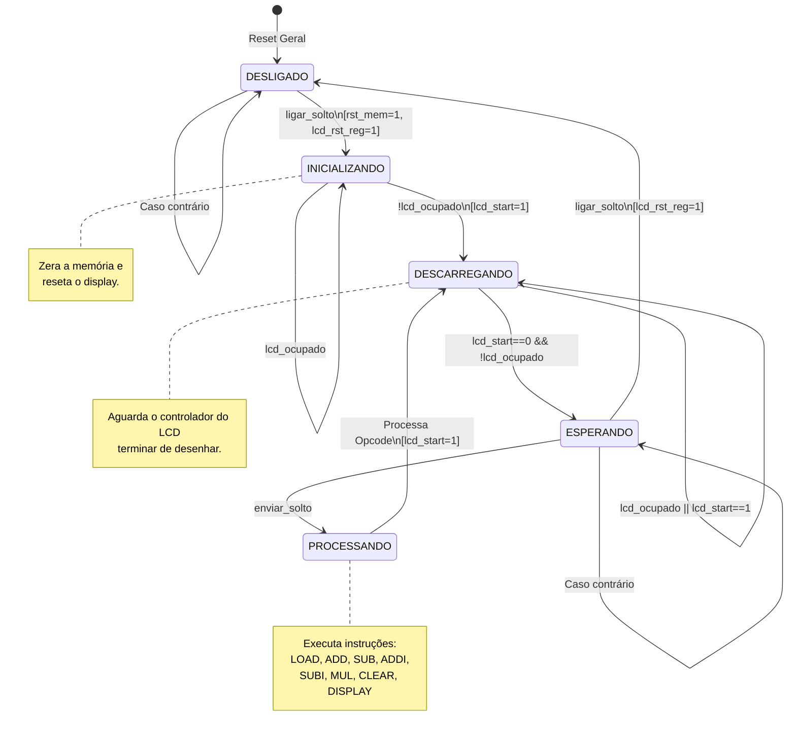
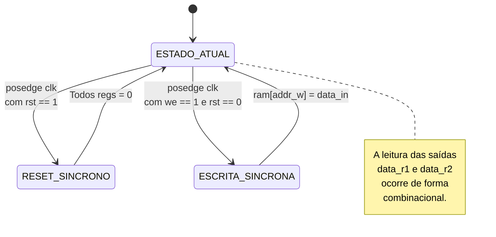
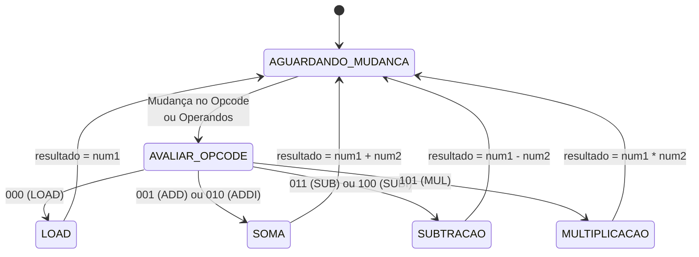
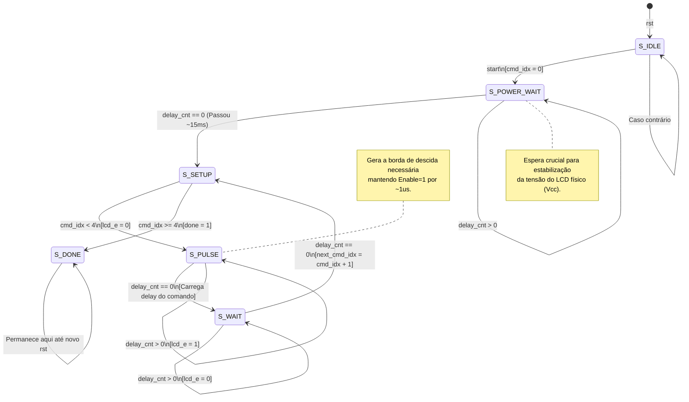
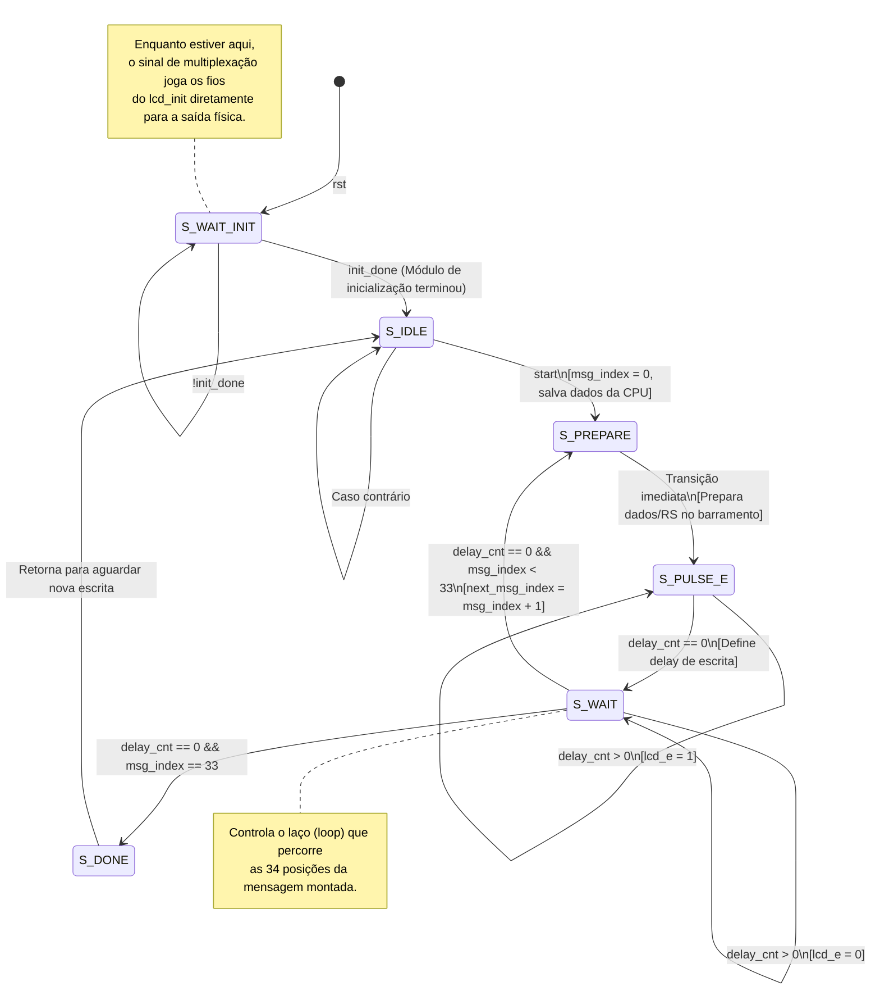

## CPU

```mermaid
stateDiagram-v2
    [*] --> DESLIGADO : Reset Geral

    DESLIGADO --> INICIALIZANDO : ligar_solto\n[rst_mem=1, lcd_rst_reg=1]
    DESLIGADO --> DESLIGADO : Caso contrário

    INICIALIZANDO --> DESCARREGANDO : !lcd_ocupado\n[lcd_start=1]
    INICIALIZANDO --> INICIALIZANDO : lcd_ocupado

    ESPERANDO --> DESLIGADO : ligar_solto\n[lcd_rst_reg=1]
    ESPERANDO --> PROCESSANDO : enviar_solto
    ESPERANDO --> ESPERANDO : Caso contrário

    PROCESSANDO --> DESCARREGANDO : Processa Opcode\n[lcd_start=1]

    DESCARREGANDO --> DESCARREGANDO : lcd_ocupado || lcd_start==1
    DESCARREGANDO --> ESPERANDO : lcd_start==0 && !lcd_ocupado

    note right of INICIALIZANDO
        Zera a memória e 
        reseta o display.
    end note

    note right of PROCESSANDO
        Executa instruções:
        LOAD, ADD, SUB, ADDI,
        SUBI, MUL, CLEAR, DISPLAY
    end note

    note right of DESCARREGANDO
        Aguarda o controlador do LCD
        terminar de desenhar.
    end note
```
## MEMORIA

```mermaid
stateDiagram-v2
    [*] --> ESTADO_ATUAL

    ESTADO_ATUAL --> RESET_SINCRONO : posedge clk<br/>com rst == 1
    RESET_SINCRONO --> ESTADO_ATUAL : Todos regs = 0

    ESTADO_ATUAL --> ESCRITA_SINCRONA : posedge clk<br/>com we == 1 e rst == 0
    ESCRITA_SINCRONA --> ESTADO_ATUAL : ram[addr_w] = data_in

    note right of ESTADO_ATUAL: A leitura das saídas<br/>data_r1 e data_r2<br/>ocorre de forma<br/>combinacional.
```
## ULA

```mermaid
stateDiagram-v2
    [*] --> AGUARDANDO_MUDANCA

    AGUARDANDO_MUDANCA --> AVALIAR_OPCODE : Mudança no Opcode<br/>ou Operandos

    AVALIAR_OPCODE --> LOAD : 000 (LOAD)
    AVALIAR_OPCODE --> SOMA : 001 (ADD) ou 010 (ADDI)
    AVALIAR_OPCODE --> SUBTRACAO : 011 (SUB) ou 100 (SUBI)
    AVALIAR_OPCODE --> MULTIPLICACAO : 101 (MUL)

    LOAD --> AGUARDANDO_MUDANCA : resultado = num1
    SOMA --> AGUARDANDO_MUDANCA : resultado = num1 + num2
    SUBTRACAO --> AGUARDANDO_MUDANCA : resultado = num1 - num2
    MULTIPLICACAO --> AGUARDANDO_MUDANCA : resultado = num1 * num2
```

## LCD_INIT

```mermaid
    stateDiagram-v2
    [*] --> S_IDLE : rst

    S_IDLE --> S_POWER_WAIT : start\n[cmd_idx = 0]
    S_IDLE --> S_IDLE : Caso contrário

    S_POWER_WAIT --> S_SETUP : delay_cnt == 0 (Passou ~15ms)
    S_POWER_WAIT --> S_POWER_WAIT : delay_cnt > 0

    S_SETUP --> S_PULSE : cmd_idx < 4\n[lcd_e = 0]
    S_SETUP --> S_DONE : cmd_idx >= 4\n[done = 1]

    S_PULSE --> S_WAIT : delay_cnt == 0\n[Carrega delay do comando]
    S_PULSE --> S_PULSE : delay_cnt > 0\n[lcd_e = 1]

    S_WAIT --> S_SETUP : delay_cnt == 0\n[next_cmd_idx = cmd_idx + 1]
    S_WAIT --> S_WAIT : delay_cnt > 0\n[lcd_e = 0]

    S_DONE --> S_DONE : Permanece aqui até novo rst

    note right of S_POWER_WAIT
        Espera crucial para estabilização
        da tensão do LCD físico (Vcc).
    end note

    note left of S_PULSE
        Gera a borda de descida necessária
        mantendo Enable=1 por ~1us.
    end note
```

## LCD_TOP

```mermaid
    stateDiagram-v2
    [*] --> S_WAIT_INIT : rst

    S_WAIT_INIT --> S_IDLE : init_done (Módulo de inicialização terminou)
    S_WAIT_INIT --> S_WAIT_INIT : !init_done

    S_IDLE --> S_PREPARE : start\n[msg_index = 0, salva dados da CPU]
    S_IDLE --> S_IDLE : Caso contrário

    S_PREPARE --> S_PULSE_E : Transição imediata\n[Prepara dados/RS no barramento]

    S_PULSE_E --> S_WAIT : delay_cnt == 0\n[Define delay de escrita]
    S_PULSE_E --> S_PULSE_E : delay_cnt > 0\n[lcd_e = 1]

    S_WAIT --> S_DONE : delay_cnt == 0 && msg_index == 33
    S_WAIT --> S_PREPARE : delay_cnt == 0 && msg_index < 33\n[next_msg_index = msg_index + 1]
    S_WAIT --> S_WAIT : delay_cnt > 0\n[lcd_e = 0]

    S_DONE --> S_IDLE : Retorna para aguardar nova escrita

    note left of S_WAIT_INIT
        Enquanto estiver aqui,
        o sinal de multiplexação joga os fios
        do lcd_init diretamente para a saída física.
    end note

    note right of S_WAIT
        Controla o laço (loop) que percorre
        as 34 posições da mensagem montada.
    end note
```

