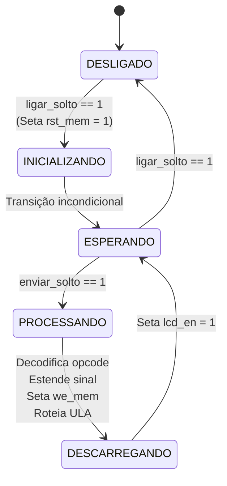
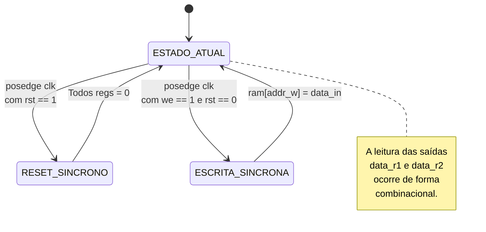
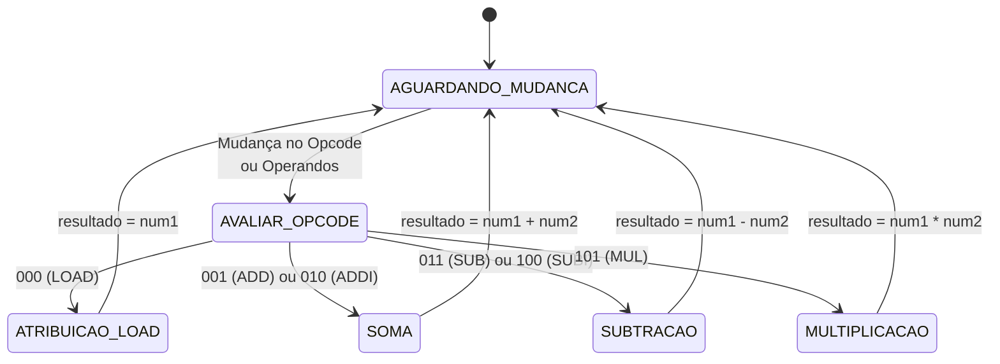

## CPU

## MEMORIA

## ULA



 ## LCD

 ```mermaid
 stateDiagram-v2
    [*] --> P_IDLE : rst = 1
    
    state P_IDLE {
        [*] --> Aguardando
        Aguardando --> Comando_Iniciado : start_print == 1
    }

    P_IDLE --> P_SET_L1 : start_print == 1 \n(is_printing <= 1)
    
    state P_SET_L1 {
        [*] --> Envia_Cmd_0x80
        Envia_Cmd_0x80 --> Espera_1ms_L1 : step == 2
        Espera_1ms_L1 --> Espera_1ms_L1 : delay_done == 0
    }
    P_SET_L1 --> P_WRITE_L1 : delay_done == 1 \n(char_count <= 0)

    state P_WRITE_L1 {
        [*] --> Envia_Char_L1
        Envia_Char_L1 --> Espera_1ms_Char1 : step == 2
        Espera_1ms_Char1 --> Espera_1ms_Char1 : delay_done == 0
    }
    P_WRITE_L1 --> P_WRITE_L1 : delay_done == 1 AND char_count < 15 \n(char_count <= char_count + 1)
    P_WRITE_L1 --> P_SET_L2 : delay_done == 1 AND char_count == 15

    state P_SET_L2 {
        [*] --> Envia_Cmd_0xC0
        Envia_Cmd_0xC0 --> Espera_1ms_L2 : step == 2
        Espera_1ms_L2 --> Espera_1ms_L2 : delay_done == 0
    }
    P_SET_L2 --> P_WRITE_L2 : delay_done == 1 \n(char_count <= 0)

    state P_WRITE_L2 {
        [*] --> Envia_Char_L2
        Envia_Char_L2 --> Espera_1ms_Char2 : step == 2
        Espera_1ms_Char2 --> Espera_1ms_Char2 : delay_done == 0
    }
    P_WRITE_L2 --> P_WRITE_L2 : delay_done == 1 AND char_count < 15 \n(char_count <= char_count + 1)
    P_WRITE_L2 --> P_DONE : delay_done == 1 AND char_count == 15

    state P_DONE {
        [*] --> Sinaliza_Fim : print_done <= 1
    }
    P_DONE --> P_IDLE : start_print == 0
 ```
