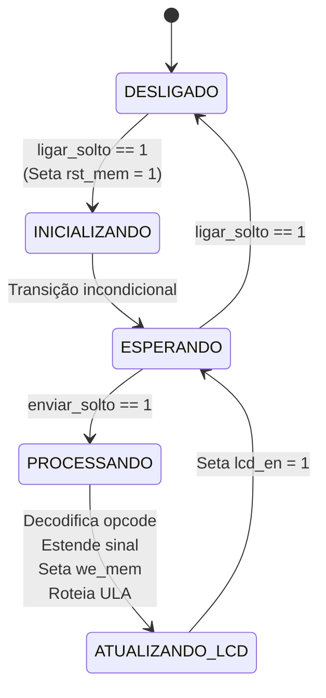
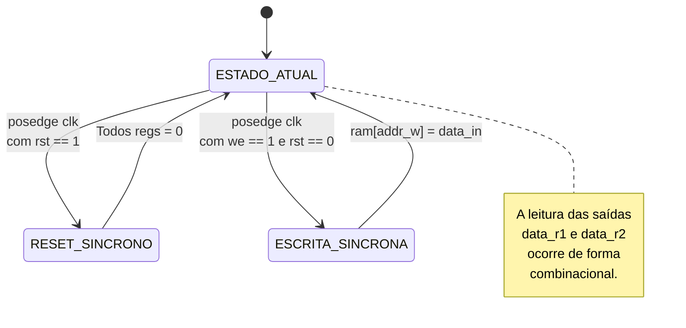
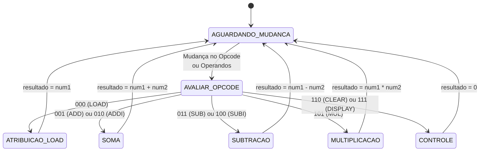

## CPU

```mermaid
stateDiagram-v2
    [*] --> DESLIGADO

    DESLIGADO --> INICIALIZANDO : ligar_solto == 1<br/>(Seta rst_mem = 1)
    
    INICIALIZANDO --> ESPERANDO : Transição incondicional

    ESPERANDO --> DESLIGADO : ligar_solto == 1
    ESPERANDO --> PROCESSANDO : enviar_solto == 1
    
    PROCESSANDO --> ATUALIZANDO_LCD : Decodifica opcode<br/>Estende sinal<br/>Seta we_mem<br/>Roteia ULA
    
    ATUALIZANDO_LCD --> ESPERANDO : Seta lcd_en = 1
```
## MEMORIA

```mermaid
stateDiagram-v2
    [*] --> ESTADO_ATUAL

    ESTADO_ATUAL --> RESET_SINCRONO : posedge clk<br/>com rst == 1
    RESET_SINCRONO --> ESTADO_ATUAL : Todos regs = 0

    ESTADO_ATUAL --> ESCRITA_SINCRONA : posedge clk<br/>com we == 1 e rst == 0
    ESCRITA_SINCRONA --> ESTADO_ATUAL : ram[addr_w] = data_in

    note right of ESTADO_ATUAL: A leitura das saídas<br/>data_r1 e data_r2<br/>ocorre de forma<br/>combinacional.
```
## ULA

```mermaid
stateDiagram-v2
    [*] --> AGUARDANDO_MUDANCA

    AGUARDANDO_MUDANCA --> AVALIAR_OPCODE : Mudança no Opcode<br/>ou Operandos

    AVALIAR_OPCODE --> ATRIBUICAO_LOAD : 000 (LOAD)
    AVALIAR_OPCODE --> SOMA : 001 (ADD) ou 010 (ADDI)
    AVALIAR_OPCODE --> SUBTRACAO : 011 (SUB) ou 100 (SUBI)
    AVALIAR_OPCODE --> MULTIPLICACAO : 101 (MUL)
    AVALIAR_OPCODE --> CONTROLE : 110 (CLEAR) ou 111 (DISPLAY)

    ATRIBUICAO_LOAD --> AGUARDANDO_MUDANCA : resultado = num1
    SOMA --> AGUARDANDO_MUDANCA : resultado = num1 + num2
    SUBTRACAO --> AGUARDANDO_MUDANCA : resultado = num1 - num2
    MULTIPLICACAO --> AGUARDANDO_MUDANCA : resultado = num1 * num2
    CONTROLE --> AGUARDANDO_MUDANCA : resultado = 0
```